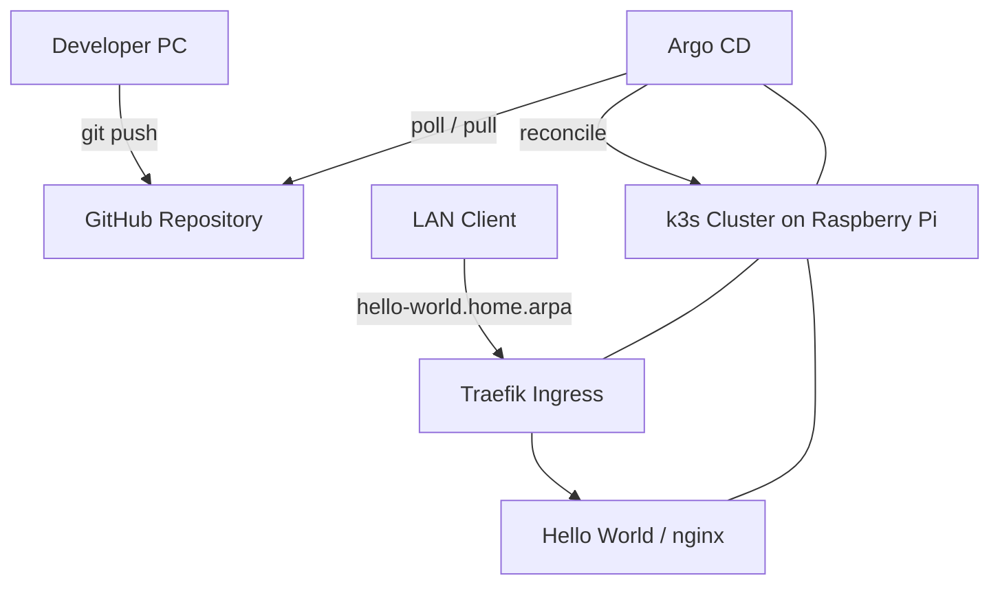

# Kubernetes Home Lab Platform

Raspberry Piと将来追加するx86ノードで構成する、自宅運用のKubernetesプラットフォームです。  
k3sを実行基盤とし、GitHubとArgo CDによるGitOpsでアプリケーションを管理します。

> A self-hosted Kubernetes platform built on Raspberry Pi and x86 nodes, managed through GitOps with Argo CD.

## 目的

このプロジェクトでは、低コストなホームラボを使って、次の仕組みを段階的に構築します。

- Gitを信頼できる唯一の情報源（Single Source of Truth）とした宣言的な構成管理
- Argo CDによる継続的デリバリーと構成ドリフトの自動修復
- Traefik IngressによるLAN内アプリケーション公開
- x86 WorkerやGPU Workerを追加できる拡張可能なクラスタ
- 監視・ログ・セキュリティを備えたセルフサービス型開発基盤
- 壁掛け家族ダッシュボードを最初の実用アプリケーションとしてデプロイ

## 現在の構成

| 項目 | 採用技術 | 状態 |
|---|---|---|
| Control Plane | Raspberry Pi 4 / Ubuntu Server 24.04 LTS | 稼働中 |
| Kubernetes | k3s | 稼働中 |
| GitOps | Argo CD | 稼働中 |
| Ingress Controller | Traefik | 稼働中 |
| サンプルアプリ | nginx 1.27-alpine | デプロイ済み |
| Worker | x86 PC | 追加予定 |
| Observability | Prometheus / Grafana | 導入予定 |

## アーキテクチャ



## GitOpsの流れ

1. Kubernetesマニフェストを変更してGitHubへpushする
2. Argo CDがリポジトリの変更を検知する
3. Git上のDesired StateとクラスタのLive Stateを比較する
4. 差分があればArgo CDがKubernetesへ自動反映する
5. 手動変更による構成ドリフトが発生した場合は、Git上の状態へ自動修復する

Hello World Applicationでは、次の自動同期設定を有効にしています。

```yaml
syncPolicy:
  automated:
    prune: true
    selfHeal: true
```

- `prune: true`: Gitから削除されたリソースをクラスタからも削除
- `selfHeal: true`: クラスタ側で手動変更されたリソースをGit上の状態へ復元

## リポジトリ構成

```text
.
├── README.md
├── applications/
│   └── hello-world/
│       ├── deployment.yaml
│       ├── ingress.yaml
│       └── service.yaml
└── argocd/
    └── applications/
        └── hello-world.yaml
```

| パス | 役割 |
|---|---|
| `applications/hello-world/` | Hello Worldを構成するDeployment、Service、Ingress |
| `argocd/applications/` | Argo CDが監視するApplication定義 |

## デプロイ

### 前提条件

- 接続先クラスタでk3sが稼働している
- Argo CDが`argocd` Namespaceへインストールされている
- `kubectl`がクラスタへ接続できる

### Argo CD Applicationの登録

```bash
kubectl apply -f argocd/applications/hello-world.yaml
```

状態を確認します。

```bash
kubectl get applications -n argocd
kubectl get pods -l app=hello-world
kubectl get ingress
```

正常時は、Applicationが`Synced / Healthy`になります。

### LAN内からのアクセス

クライアント端末のhostsファイルまたはLAN内DNSに、k3sノードのIPアドレスを登録します。

```text
<K3S_NODE_IP> hello-world.home.arpa
```

ブラウザから次のURLへアクセスします。

```text
http://hello-world.home.arpa
```

## 動作確認済み

- GitHubへのpushをArgo CDが検知し、クラスタへ自動反映
- Deploymentのレプリカ数を1から2へ変更し、Podが自動追加されることを確認
- `kubectl scale`による手動変更を、Argo CDのself-healがGit上の状態へ自動復元
- Traefik Ingress経由でLAN内クライアントからnginxへアクセス
- ApplicationSet CRDを導入し、Argo CDの全コンポーネントが正常稼働

## ロードマップ

- [x] Raspberry Pi 4へUbuntu Serverとk3sを導入
- [x] Argo CDによるGitOps環境を構築
- [x] Hello WorldアプリケーションをGitOps管理
- [x] Traefik Ingress経由でLAN内公開
- [x] 自動同期とself-healを検証
- [ ] アプリケーションごとのNamespace分離
- [ ] readiness/liveness probeとリソース制限の追加
- [ ] Kustomizeによる環境別構成管理
- [ ] PrometheusとGrafanaによるObservability導入
- [ ] x86 Workerノードの追加
- [ ] 壁掛け家族ダッシュボードのデプロイ
- [ ] Secrets管理、TLS、外部アクセス方式の設計
