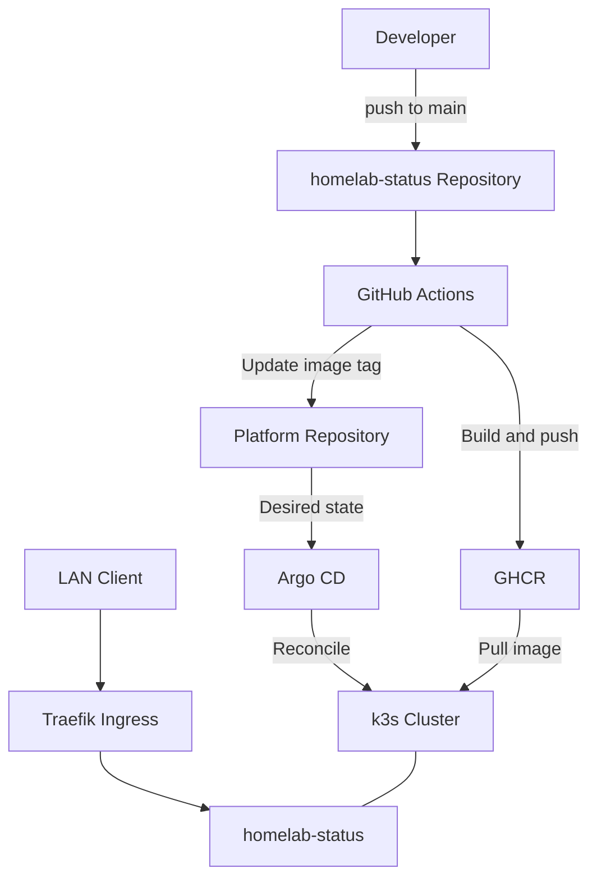

# Kubernetes Home Lab Platform

Raspberry Piを起点に構築している、自宅運用のKubernetesプラットフォームです。k3sを実行基盤とし、GitHub Actions、GHCR、Argo CDを組み合わせて、アプリケーションのビルドからクラスタへの反映までを自動化しています。

> A self-hosted Kubernetes platform built on Raspberry Pi, with automated CI/CD and GitOps deployment through GitHub Actions, GHCR, and Argo CD.

## 目的

低コストなホームラボを使い、宣言的な構成管理、継続的デリバリー、監視、セキュリティ、ノード拡張を段階的に学び、実用アプリケーションを運用できる基盤を構築します。最終的には、家族向け壁掛けダッシュボードや研究用ワークロードを載せられる環境を目指します。

## 現在の構成

| 項目 | 採用技術・構成 | 状態 |
|---|---|---|
| Control Plane | Raspberry Pi 4 / Ubuntu Server / k3s | 稼働中 |
| GitOps | Argo CD | 稼働中 |
| Ingress Controller | Traefik | 稼働中 |
| 実用アプリ | homelab-status（Go） | デプロイ済み |
| コンテナレジストリ | GitHub Container Registry（GHCR） | 利用中 |
| CI/CD | GitHub Actions → GHCR → Platform Repository → Argo CD | 自動化済み |
| PC Worker | Core i5-13500 / 48GB RAM | 導入準備中 |
| Observability | Prometheus / Grafana | 導入予定 |
| 外部公開・LAN内DNS | 未構築 | 将来検討 |

現時点ではRaspberry Pi上でアプリケーションを運用しています。PC Workerのクラスタ参加やProxmox導入は、まだ完了済みとして扱いません。

## アーキテクチャ



アプリケーションのソースコードとKubernetesの構成は、別リポジトリで管理しています。

- [homelab-status](https://github.com/Malin502/homelab-status): Goアプリケーション、Dockerfile、CI/CDワークフロー
- [k8s-homelab-platform](https://github.com/Malin502/k8s-homelab-platform): Kubernetesマニフェスト、Argo CD Application定義

## 自動デプロイの流れ

1. `homelab-status` の`main`へpushする。
2. GitHub Actionsが`linux/arm64`のコンテナイメージをビルドし、GHCRへpushする。
3. イメージには`sha-<commit SHA>`と`latest`のタグを付ける。
4. ワークフローがPlatform Repositoryをチェックアウトし、Deploymentのイメージタグを新しいコミットSHAへ更新する。
5. 変更があればPlatform Repositoryへコミット・pushする。
6. Argo CDがGit上のDesired StateとクラスタのLive Stateを比較し、変更を自動反映する。

CIからPlatform Repositoryへの更新には、`PLATFORM_REPO_TOKEN`を使用します。GHCRへのpushにはGitHub Actionsの`GITHUB_TOKEN`を使用します。トークンの値はリポジトリに記載しません。

`latest`を公開するだけでなく、**コミットSHAで特定できるイメージをDeploymentに記録する**構成です。これにより、アプリケーションの変更からGitOpsによる反映までがつながっています。

## リポジトリ構成

```text
.
├── README.md
├── applications/
│   └── homelab-status/
│       ├── clusterrole.yaml
│       ├── clusterrolebinding.yaml
│       ├── deployment.yaml
│       ├── ingress.yaml
│       ├── service.yaml
│       └── serviceaccount.yaml
└── argocd/
    └── applications/
        └── homelab-status.yaml
```

`applications/homelab-status/`はアプリケーションのKubernetesリソース、`argocd/applications/`はArgo CD Applicationの定義を管理します。現状はApplicationを個別に登録する構成であり、App of Appsは未導入です。

## homelab-status

クラスタの状態を確認するための軽量なGo製Webアプリケーションです。現在のDeploymentは`default` Namespaceで1レプリカを実行し、`pi-control`へ配置しています。

ServiceAccountとRBACを用意し、ノード情報に対して`get`・`list`権限を付与しています。Webアプリケーションはコンテナ内の8080番ポートを使用し、ServiceとTraefik Ingressを経由してLAN内へ公開します。

### Applicationの登録

```bash
kubectl apply -f argocd/applications/homelab-status.yaml
```

### 状態確認

```bash
kubectl get applications -n argocd
kubectl get deployment,pod,service,ingress -n default
```

Argo CDのWeb UIを開く場合は、次のport-forwardを実行します。

```bash
kubectl port-forward svc/argocd-server -n argocd 8080:443
```

ブラウザから`https://localhost:8080`へアクセスします。ローカルの自己署名証明書による警告が表示される場合があります。

### LAN内アクセス

Ingressのホスト名は`homelab-status.home.arpa`です。LAN内DNSはまだ構築していないため、必要に応じてクライアントのhostsファイルでk3sノードのIPアドレスに対応付けます。

```text
<K3S_NODE_IP> homelab-status.home.arpa
```

```text
http://homelab-status.home.arpa
```

このアプリケーションはLAN内での利用を前提としています。外部公開、認証、TLSなどは今後の設計対象です。

## GitOpsとリソース削除

現在のApplicationには、次の自動同期設定があります。

```yaml
syncPolicy:
  automated:
    prune: true
    selfHeal: true
```

- `prune: true`: Git上の管理対象からなくなったリソースをクラスタから削除する。
- `selfHeal: true`: クラスタ側の手動変更などによる構成ドリフトをGit上の状態へ戻す。

### サンプルアプリ撤去時の学び

Hello World（nginx）でGitOps、Ingress、レプリカ変更、self-healを検証した後、実用アプリへ移行するため撤去しました。

`applications/hello-world/`をディレクトリごと削除したところ、Argo CDが参照先のマニフェストを生成できずSync errorとなり、Deployment・Service・Ingressがクラスタ上に残りました。残ったリソースは手動で削除しました。

今後は、**Applicationを残したまま、参照可能なディレクトリからマニフェストを削除 → Pruneの完了を確認 → Applicationを削除**の順序で撤去します。Application自体を削除する場合も、管理対象リソースの削除状態を確認します。

この経験から、Git上のファイル削除とクラスタ上のリソース削除は別の処理であり、Pruneが実行・完了できる状態を維持する必要があることを確認しました。

## 動作確認済み

- Raspberry Pi 4へのUbuntu Server・k3s導入
- Argo CDによるGitOps管理と自動同期
- Traefik Ingress経由のLAN内アクセス
- Hello Worldのレプリカ変更とself-healの検証
- Go製`homelab-status`のビルド・コンテナ化・デプロイ
- GitHub ActionsによるGHCRへのイメージ公開
- CIからPlatform Repositoryのイメージタグを更新する自動CD
- `homelab-status`のArgo CD同期と稼働確認
- Hello Worldの撤去と、Prune失敗時の残存リソースの確認

## ロードマップ

- [x] Raspberry Pi 4へUbuntu Serverとk3sを導入
- [x] Argo CDによるGitOps環境を構築
- [x] Hello WorldでIngress・自動同期・self-healを検証
- [x] Go製homelab-statusをデプロイ
- [x] GitHub Actions → GHCR → GitOpsによる自動CDを構築
- [x] Hello Worldサンプルを撤去
- [ ] PC Workerをクラスタへ追加
- [ ] Prometheus / GrafanaによるObservability導入
- [ ] アプリケーションごとのNamespace分離
- [ ] readiness/liveness probeとリソース制限の追加
- [ ] Kustomizeによる環境別構成管理
- [ ] Secrets管理、TLS、外部アクセス方式の設計
- [ ] LAN内DNS・リバースプロキシなどの常時稼働基盤を整備
- [ ] 壁掛け家族ダッシュボードのデプロイ
- [ ] 研究用ワークロード・GPU Workerへの拡張

## 開発記録

このリポジトリは、完成した構成だけでなく、設計判断やトラブルシュートを含む学習記録としても運用しています。サンプルアプリから実用アプリへの移行、CI/CDの自動化、今後のノード拡張や監視基盤の導入を段階的に記録します。
